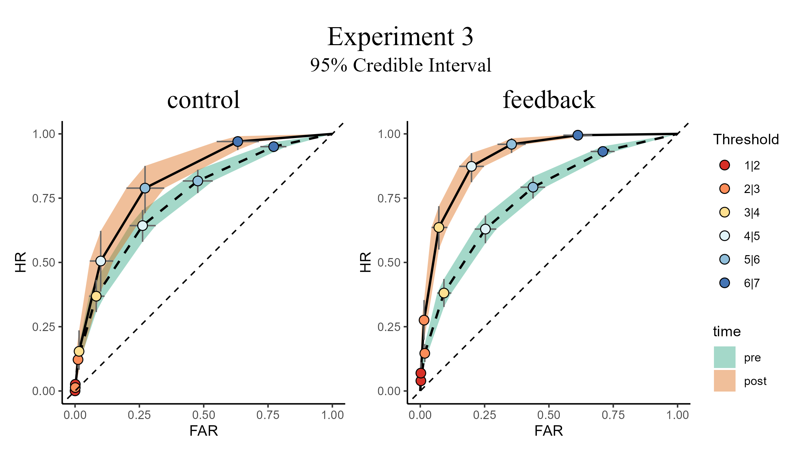
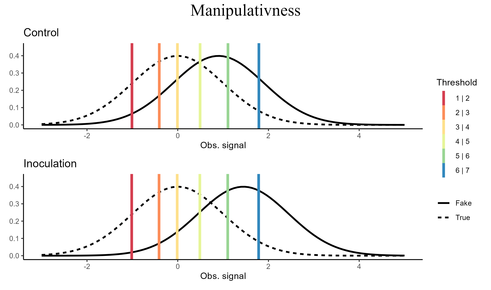
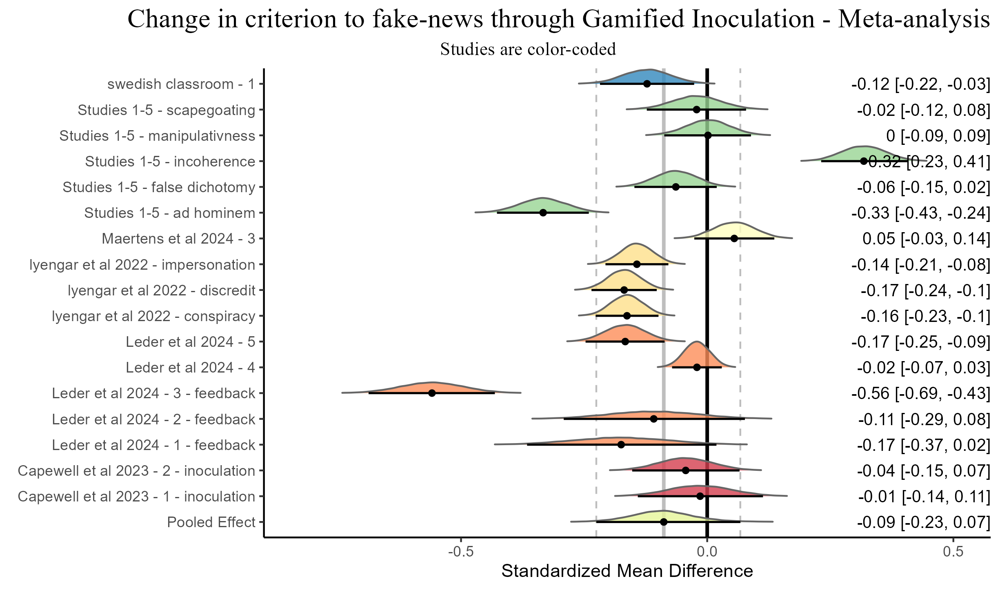

# OrdinalRegressionViz

<!-- badges: start -->
[](https://github.com/tomerzipori/OrdinalRegressionViz/actions/workflows/R-CMD-check.yaml)
[](https://lifecycle.r-lib.org/articles/stages.html#experimental)
[](https://github.com/tomerzipori/OrdinalRegressionViz/blob/master/DESCRIPTION)
[](https://opensource.org/licenses/MIT)
<!-- badges: end -->

## Overview

OrdinalRegressionViz provides publication-ready `ggplot2` visualizations for
ordinal (cumulative) regression models, framed in signal detection theory
(SDT) terms. It is aimed at researchers who analyze rating-scale data with
ordinal probit (or other cumulative link) models — for example, perceived
truth ratings of true and fake news headlines — using the `ordinal` or
`brms` packages.

The package draws:

- **ROC curves** with confidence or credible bands: `roc_plot()` for
  `ordinal::clm()`/`clmm()` models, `bayesian_roc_plot()` for `brms` models.
- **Latent SDT distributions** with response thresholds (criteria):
  `SDT_distributions_plot()` and `bayesian_SDT_distribution_plot()`. The
  Bayesian version supports unequal-variance models through the `disc`
  distributional parameter.
- **Grouped posterior predictive checks** for ordinal `brms` models:
  `ordinal_model_ppd_check()`.
- **Forest plots** for Bayesian random-effects meta-analyses:
  `bayesian_forest()`.

It also computes the numbers behind the plots: `sdt_indices()` returns tidy
signal detection indices (d', the signal/noise scale ratio, criteria, and
AUC) per design cell — with full posterior uncertainty for `brms` models.

All functions return `ggplot`/`patchwork` objects that you can modify and
save with `ggplot2::ggsave()`. The visualizations accompany Simchon, Zipori,
Teitelbaum, Lewandowsky, and van der Linden (2026); see
[Citation](#citation) below.

## Installation

```r
# install.packages("remotes")
remotes::install_github("tomerzipori/OrdinalRegressionViz")
```

The model-fitting packages are suggested, not required: install `ordinal`
for the frequentist plot functions and `brms` for the Bayesian ones,
depending on which models you fit.

## Quick start

The packaged dataset `sdt_ratings` contains simulated 6-point perceived-truth
ratings of true and fake headlines, before and after an inoculation
intervention. Fit a cumulative probit model with `ordinal::clm()` and plot
it:

```r
library(OrdinalRegressionViz)

fit <- ordinal::clm(
  value ~ target * time,
  data = subset(sdt_ratings, condition == "control"),
  link = "probit"
)

# ROC curve: one curve per level of `time`, points at the response thresholds;
# `show_empirical` overlays the observed rates as a fit check
roc_plot(fit, var_signal = "target", var_group = "time", show_empirical = TRUE)

# Latent distributions and thresholds, one panel per level of `time`
SDT_distributions_plot(fit, var_signal = "target", var_group = "time")

# The corresponding SDT indices: d', sigma ratio, criteria, AUC
sdt_indices(fit, var_signal = "target", var_group = "time")
```

The first level of `var_signal` is treated as the signal class, and the hit
rate is the probability of a low response category given signal — here,
rating a fake headline (`target = "fake"`) as fake (low perceived truth).

## Bayesian example

The Bayesian functions expect a `brms` cumulative model. An
unequal-variance SDT model adds a `disc` (discrimination) part. Note:
sampling takes a few minutes.

```r
b_fit <- brms::brm(
  brms::bf(value ~ target * time, disc ~ target * time),
  family = brms::cumulative("probit"),
  data = subset(sdt_ratings, condition == "control")
)

bayesian_roc_plot(b_fit, var_signal = "target", var_group = "time")

bayesian_SDT_distribution_plot(
  b_fit,
  var_signal = "target", var_group = "time",
  plot_range = c(-4, 6), ndraws = 500
)

ordinal_model_ppd_check(b_fit, group_vars = c("target", "time"))
```

## Gallery

### ROC curve

<p align="center">
  
</p>

### Latent SDT distributions

<p align="center">
  
</p>

### Bayesian random-effects meta-analysis

<p align="center">
  
</p>

## Citation

To cite the package, run `citation("OrdinalRegressionViz")` in R, or use:

> Zipori, T. (2026). *OrdinalRegressionViz: Visualize Ordinal Probit
> Regression Models with ggplot2*. R package version 0.2.0.
> https://github.com/tomerzipori/OrdinalRegressionViz

The visualizations accompany:

> Simchon, A., Zipori, T., Teitelbaum, L., Lewandowsky, S., & van der
> Linden, S. (2026). A signal detection theory meta-analysis of
> psychological inoculation against misinformation. *Current Opinion in
> Psychology*, *67*, 102194. https://doi.org/10.1016/j.copsyc.2025.102194

## License

MIT. See [LICENSE.md](LICENSE.md).
