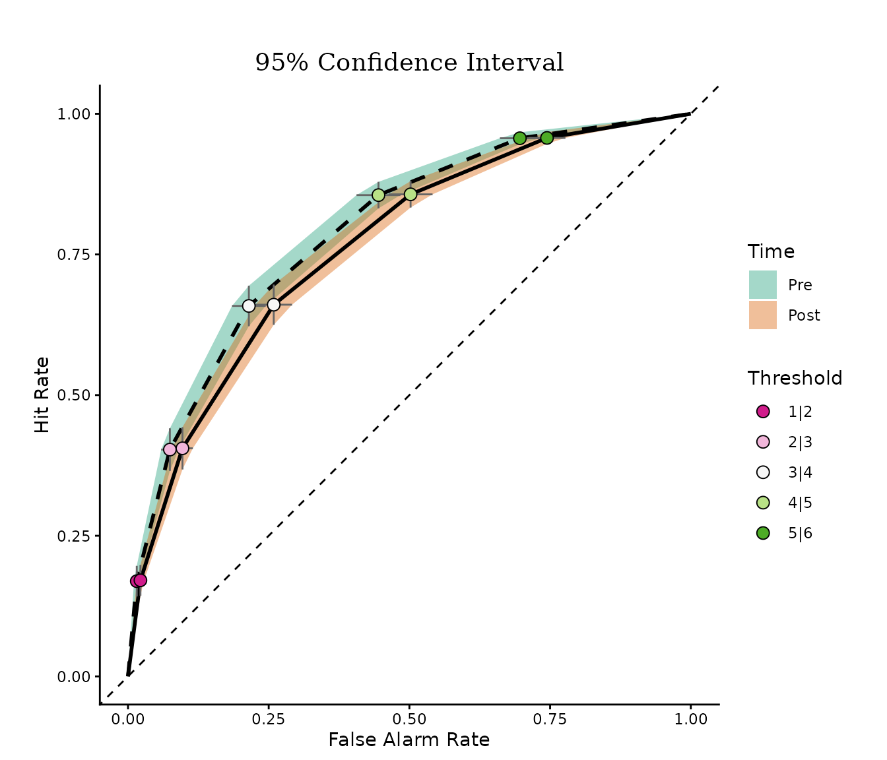
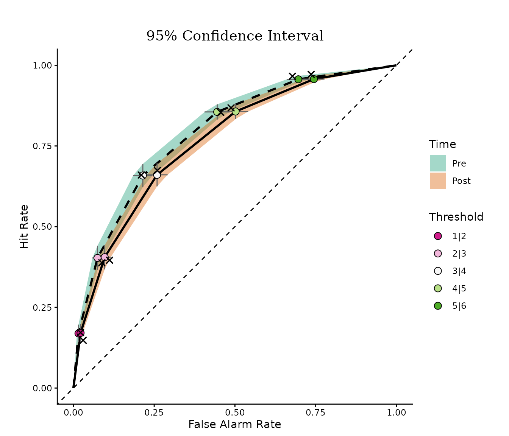
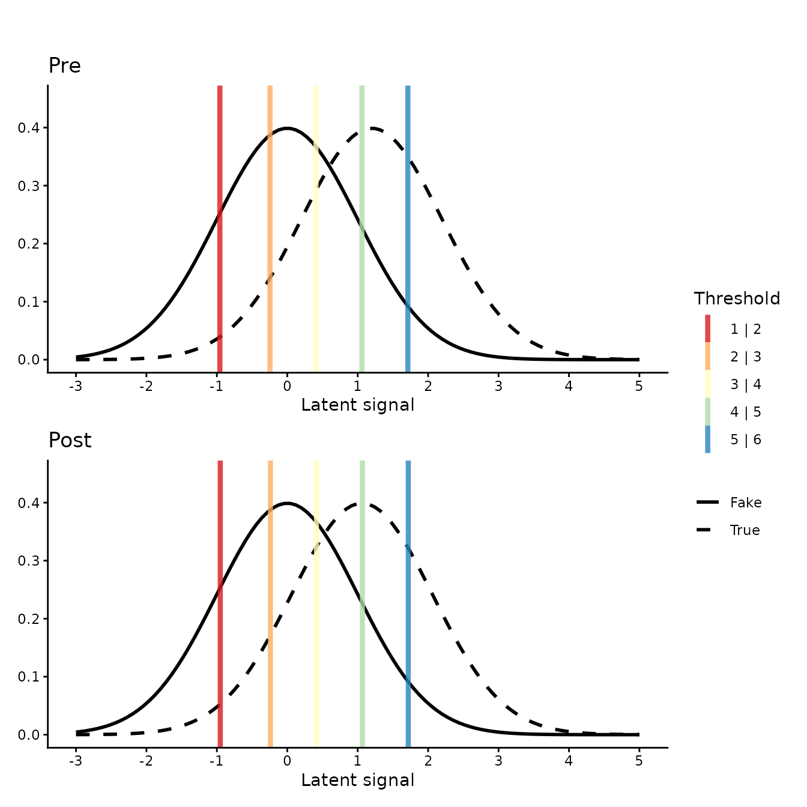
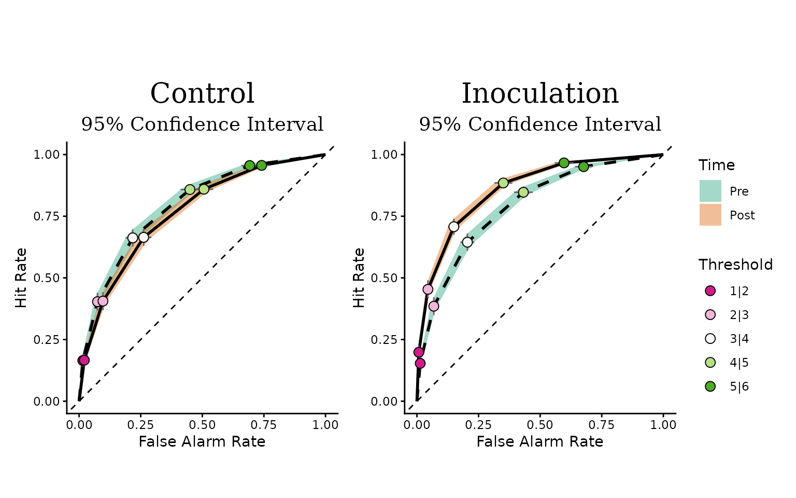

# Visualizing ordinal regression models

## Ordinal models as signal detection models

Rating-scale responses — “how true does this headline seem, from 1 to
6?” — are ordinal: the categories are ordered, but the distances between
them are unknown. Cumulative link models (ordinal regression) handle
this by assuming a continuous latent variable that is cut into observed
categories by a set of thresholds. When the link is probit, this is
exactly the model of classic signal detection theory (SDT): each
stimulus class produces a normal distribution on a latent “perceived
signal” axis, and the thresholds are the response criteria. The distance
between the distributions is the discriminability (d’), and the
placement of the thresholds captures response bias.

This equivalence means an ordinal regression fit can be displayed in two
complementary ways. The latent-distribution plot shows the two stimulus
distributions and the thresholds directly. The receiver operating
characteristic (ROC) curve plots the hit rate against the false-alarm
rate at every threshold, summarizing discrimination independently of
bias. OrdinalRegressionViz draws both, for frequentist models fitted
with
[`ordinal::clm()`](https://rdrr.io/pkg/ordinal/man/clm.html)/`clmm()`
and for Bayesian models fitted with
[`brms::brm()`](https://paulbuerkner.com/brms/reference/brm.html).

These visualizations accompany Simchon, Zipori, Teitelbaum, Lewandowsky,
and van der Linden (2026), “A signal detection theory meta-analysis of
psychological inoculation against misinformation”, *Current Opinion in
Psychology*, 67, 102194 (<doi:10.1016/j.copsyc.2025.102194>), where the
same displays are used to compare discrimination and response bias
before and after psychological inoculation interventions.

``` r

library(OrdinalRegressionViz)
```

## The `sdt_ratings` dataset

The package ships with `sdt_ratings`, a simulated trial-level dataset in
a 2 x 2 x 2 signal-detection design. Fifty participants in two
conditions (`control` / `inoculation`) rated true and fake news
headlines (`target`) before and after the intervention (`time`) on a
6-point perceived-truth scale (`value`; 1 = “definitely fake”, 6 =
“definitely true”):

``` r

str(sdt_ratings)
#> 'data.frame':    4000 obs. of  5 variables:
#>  $ id       : Factor w/ 50 levels "S01","S02","S03",..: 1 1 1 1 1 1 1 1 1 1 ...
#>  $ condition: Factor w/ 2 levels "control","inoculation": 1 1 1 1 1 1 1 1 1 1 ...
#>  $ time     : Factor w/ 2 levels "pre","post": 1 1 1 1 1 1 1 1 1 1 ...
#>  $ target   : Factor w/ 2 levels "fake","true": 1 1 1 1 1 1 1 1 1 1 ...
#>  $ value    : Ord.factor w/ 6 levels "1"<"2"<"3"<"4"<..: 4 5 2 3 3 2 2 1 2 1 ...
```

The data were generated from an unequal-variance probit SDT model in
which inoculation increases post-intervention discrimination (d’) and
makes the response criteria stricter. The generating code is in
`data-raw/sdt_ratings.R` in the source repository.

## Frequentist workflow

Fit a cumulative probit model on the control condition with
[`ordinal::clm()`](https://rdrr.io/pkg/ordinal/man/clm.html):

``` r

fit <- ordinal::clm(
  value ~ target * time,
  data = subset(sdt_ratings, condition == "control"),
  link = "probit"
)
```

### ROC curve

[`roc_plot()`](https://tomerzipori.github.io/OrdinalRegressionViz/reference/roc_plot.md)
draws one ROC curve per level of `var_group`, with confidence bands and
one point per response threshold. The first level of `var_signal` is
treated as the signal class, and the hit rate is the probability of a
low response category given signal — here, giving a fake headline
(`target = "fake"`) a low perceived-truth rating:

``` r

roc_plot(fit, var_signal = "target", var_group = "time")
```



The farther a curve bows away from the diagonal (chance performance),
the better participants discriminate fake from true headlines. In the
control condition the pre and post curves are close to each other, as
expected: no intervention took place between the two measurements.

Setting `show_empirical = TRUE` overlays the observed hit and
false-alarm rates as crosses — if the model fits, they should sit on or
near the model-implied curves:

``` r

roc_plot(
  fit,
  var_signal = "target", var_group = "time",
  show_empirical = TRUE
)
```



### Latent distributions

[`SDT_distributions_plot()`](https://tomerzipori.github.io/OrdinalRegressionViz/reference/SDT_distributions_plot.md)
shows the same model as latent distributions. Each panel corresponds to
one level of `var_group` and displays the noise and signal distributions
together with the five estimated thresholds:

``` r

SDT_distributions_plot(fit, var_signal = "target", var_group = "time")
```



The horizontal distance between the two curves within a panel is d’. The
vertical lines are the response criteria: their spacing shows how the
6-point scale maps onto the latent axis, and shifts of the whole set
between panels indicate a change in response bias.

### Faceting by a third variable

To compare conditions, fit the model on the full dataset and pass the
third factor as `var_facet`. Two ROC panels are drawn side by side:

``` r

fit3 <- ordinal::clm(
  value ~ target * time * condition,
  data = sdt_ratings,
  link = "probit"
)

roc_plot(
  fit3,
  var_signal = "target", var_group = "time", var_facet = "condition"
)
```



In the inoculation panel the post curve bows out farther than the pre
curve: discrimination improved after the intervention. The same argument
works in
[`SDT_distributions_plot()`](https://tomerzipori.github.io/OrdinalRegressionViz/reference/SDT_distributions_plot.md),
which then draws a 2 x 2 grid of panels.

### SDT indices

[`sdt_indices()`](https://tomerzipori.github.io/OrdinalRegressionViz/reference/sdt_indices.md)
returns the quantities behind these displays as a tidy data frame: the
sensitivity index d’, the signal/noise scale ratio, the response
criteria, and the area under the implied ROC curve, one set per design
cell:

``` r

sdt_indices(
  fit3,
  var_signal = "target", var_group = "time", var_facet = "condition"
)
#>    time   condition         index   estimate lower upper
#> 1   pre     control       d_prime  1.1990756    NA    NA
#> 2   pre     control   sigma_ratio  1.0000000    NA    NA
#> 3   pre     control           auc  0.8017461    NA    NA
#> 4   pre     control criterion 1|2 -0.9742724    NA    NA
#> 5   pre     control criterion 2|3 -0.2440087    NA    NA
#> 6   pre     control criterion 3|4  0.4188225    NA    NA
#> 7   pre     control criterion 4|5  1.0723579    NA    NA
#> 8   pre     control criterion 5|6  1.7013752    NA    NA
#> 9  post     control       d_prime  1.0617237    NA    NA
#> 10 post     control   sigma_ratio  1.0000000    NA    NA
#> 11 post     control           auc  0.7735990    NA    NA
#> 12 post     control criterion 1|2 -0.9684612    NA    NA
#> 13 post     control criterion 2|3 -0.2381975    NA    NA
#> 14 post     control criterion 3|4  0.4246337    NA    NA
#> 15 post     control criterion 4|5  1.0781691    NA    NA
#> 16 post     control criterion 5|6  1.7071864    NA    NA
#> 17  pre inoculation       d_prime  1.1955164    NA    NA
#> 18  pre inoculation   sigma_ratio  1.0000000    NA    NA
#> 19  pre inoculation           auc  0.8010444    NA    NA
#> 20  pre inoculation criterion 1|2 -1.0221918    NA    NA
#> 21  pre inoculation criterion 2|3 -0.2919281    NA    NA
#> 22  pre inoculation criterion 3|4  0.3709031    NA    NA
#> 23  pre inoculation criterion 4|5  1.0244385    NA    NA
#> 24  pre inoculation criterion 5|6  1.6534558    NA    NA
#> 25 post inoculation       d_prime  1.5832086    NA    NA
#> 26 post inoculation   sigma_ratio  1.0000000    NA    NA
#> 27 post inoculation           auc  0.8685360    NA    NA
#> 28 post inoculation criterion 1|2 -0.8470587    NA    NA
#> 29 post inoculation criterion 2|3 -0.1167950    NA    NA
#> 30 post inoculation criterion 3|4  0.5460362    NA    NA
#> 31 post inoculation criterion 4|5  1.1995716    NA    NA
#> 32 post inoculation criterion 5|6  1.8285889    NA    NA
```

For `clm` models these are point estimates. The same call on a `brmsfit`
(below) uses the full posterior and adds credible intervals — useful
when you want to report, say, *d’ = 1.9, 95% CrI \[1.6, 2.2\]*.

## Bayesian workflow

The Bayesian functions expect a cumulative model fitted with
[`brms::brm()`](https://paulbuerkner.com/brms/reference/brm.html). An
unequal-variance SDT model adds a distributional part for `disc`, the
discrimination (inverse scale) of the latent distribution. Sampling
takes a few minutes, so the chunks in this section are not evaluated
here:

``` r

b_fit <- brms::brm(
  brms::bf(value ~ target * time, disc ~ target * time),
  family = brms::cumulative("probit"),
  data = subset(sdt_ratings, condition == "control")
)
```

[`bayesian_roc_plot()`](https://tomerzipori.github.io/OrdinalRegressionViz/reference/bayesian_roc_plot.md)
draws the posterior ROC curve per level of `var_group`, with curvewise
credible bands:

``` r

bayesian_roc_plot(b_fit, var_signal = "target", var_group = "time")
```

[`bayesian_SDT_distribution_plot()`](https://tomerzipori.github.io/OrdinalRegressionViz/reference/bayesian_SDT_distribution_plot.md)
draws the posterior latent distributions with credible bands around each
density, and the posterior distribution of each threshold as a slab on
the x axis. With a `disc` part the two latent distributions can have
different widths (unequal-variance SDT); without it, unit scales are
used. `ndraws` subsamples the posterior draws to speed up the density
bands:

``` r

bayesian_SDT_distribution_plot(
  b_fit,
  var_signal = "target", var_group = "time",
  plot_range = c(-4, 6), ndraws = 500
)
```

[`ordinal_model_ppd_check()`](https://tomerzipori.github.io/OrdinalRegressionViz/reference/ordinal_model_ppd_check.md)
compares the observed response distribution with posterior predictive
draws, in one facet per combination of the grouping variables:

``` r

ordinal_model_ppd_check(b_fit, group_vars = c("target", "time"))
```

Finally,
[`sdt_indices()`](https://tomerzipori.github.io/OrdinalRegressionViz/reference/sdt_indices.md)
on a `brmsfit` summarizes the posterior of every SDT index with a
credible interval:

``` r

sdt_indices(b_fit, var_signal = "target", var_group = "time", ci = 0.95)
```

## Notes

- **Links other than probit.** The latent distribution follows the
  model’s link function: normal for `probit`, logistic for `logit`,
  Cauchy for `cauchit`, and Gumbel for `cloglog`/`loglog`. The probit
  link gives the classic SDT display.
- **Saving plots.** All functions return `ggplot`/`patchwork` objects.
  Save them with
  [`ggplot2::ggsave()`](https://ggplot2.tidyverse.org/reference/ggsave.html),
  for example
  `ggplot2::ggsave("roc.png", roc_plot(fit, "target", "time"), width = 7, height = 6, dpi = 300)`.
